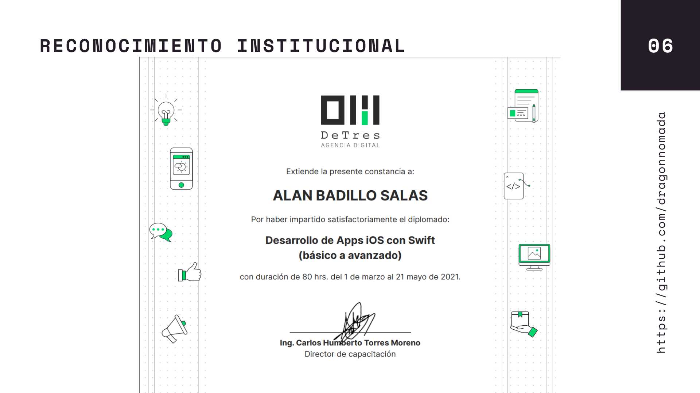
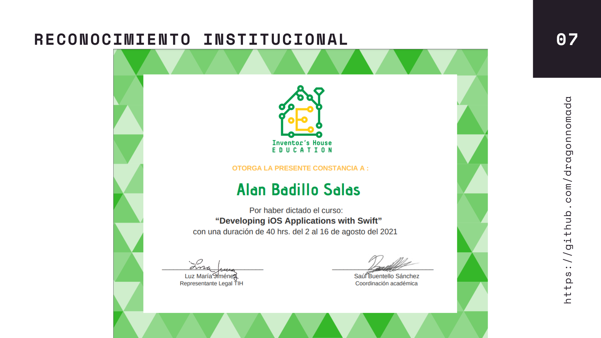

# Portafolio de Swift - Alan Badillo Salas

## PRESENTACIÓN

<!--  -->
<!--  -->

## PROYECTOS

> Proyectos con Swift

[https://github.com/dragonnomada/swift-projects](https://github.com/dragonnomada/swift-projects)

* 14 Proyectos Avanzados
* Uso de mapas
* Dibujos sobre Mapas
* Grabación de audio
* Reproductor multimedia
* Consumo de servicios web
* Uso de mensajería Multipeer
* Pruebas unitarias
* Persistencia en iCloud

> CURSO INTEGRAL DE DESARROLLO EN IOS CON SWIFT

[https://github.com/dragonnomada/swift-may-2022](https://github.com/dragonnomada/swift-may-2022)

* Curso impartido en Mayo del 2022
* Más de 67 proyectos y ejercicios
* Ejercicios integrales y progresivos
* 12 sesiones teóricas y prácticas
* Código actualizado a IOS 15 y Swift 5.6
* Proyectos documentados en Github
* Uso de mapas y captura de imágenes y video

Algunos resultados del curso:

